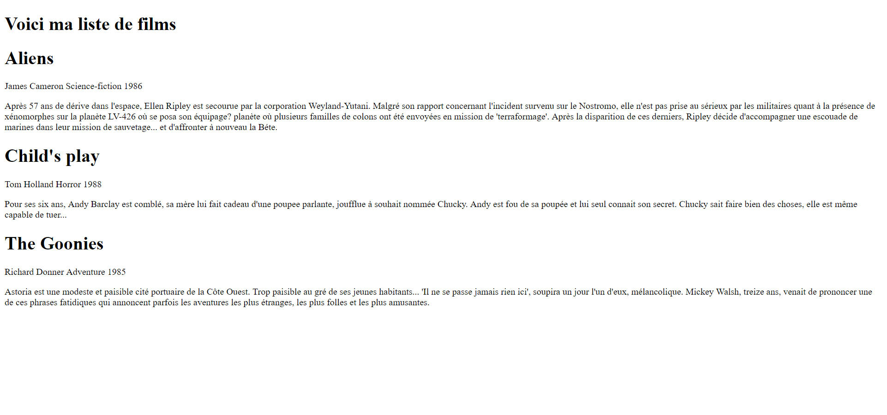

# Lire et écrire dans fichier avec PHP

**1°)** Afficher la liste des films présents dans le fichier  *"./data/movies.csv "* dans le fichier *"./ index.php "*. Pour ce faire vous utiliserez les fonctions `fgets()` ou `fgetcsv()`.

 

    

 

**2°)** Créer un fichier *"ajoutFilm.php"* à la racine du dossier. On retrouvera sur ce fichier un formulaire permettant de d'insérer un nouveau film dans le fichier *"movies.csv"*. Voici la liste des champs nécessaire :

- **Numéro** identifiant *(nombre)*
- **Titre** *(Chaîne de caractères courte)*
- **Réalisateur** *(Chaîne de caractères courte)*
- **Genre** *(Liste, un film peut avoir plusieurs genres)*
- **Résumé** *(Chaîne de caractères longue)*
- **Année de sortie** *(Date)* 

 

    

 

### Règles
1. On contrôle les données saisies par l'utilisateur
2. On ne peut pas insérer une ligne dans le fichier *"movies.csv"* si des éléments sont manquants.
3. On affiche les erreurs, s'il y en a 
4. Si l'insertion de la ligne c'est correctement exécuté, on redirige l'utilisateur vers *"./index.php"*
5. **Bonus :** l'utilisateur ne pas insérer une ligne si le *numéro d'identifiant* est déjà existant dans le fichier *"movies.csv"*
